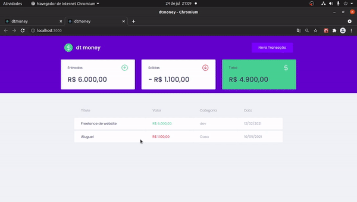

<h1 align="center">
    
</h1>

<h1 align="center">
    
</h1>

## 🏷️ Sobre 
**dt money** é uma aplicação de controle de finanças que te possibilita controlar entradas e saídas do seu dinheiro e também ter acesso a quando e com o que você gastou esse dinheiro.

---

## 🛠️ Tecnologias utilizadas
Foram utilizadas as seguintes tecnologias para desenvolver a aplicação **dt money**:

- [React](https://pt-br.reactjs.org/)
- [Typescript](https://www.typescriptlang.org/)
- [Styled-components](https://styled-components.com/)
- [miragejs](https://miragejs.com/)

---

## 🗂️ Como baixar e iniciar o projeto 

```bash

    #clonar o projeto
    $ git clone https://github.com/ElisioWander/dtmoney-bootcamp-ignite-rocketseat.git

    #entrar no diretório
    $ cd dtmoney-bootcamp-ignite-rocketseat

    #instalar as dependências
    $ yarn

    #iniciar a aplicação
    $ yarn dev
```
### Servidor local
localhost:3000

---

## Autor
### 👤 Elisio Wander

- Linkedin: [@elisioWander](https://www.linkedin.com/in/elisio-wander-b88b69136/)
- github: [@elisioWander](https://github.com/ElisioWander)

---
## 📝 Licença
Copyright © 2020 [@ElisioWander]()

Este projeto está sobe a [LICENÇA MIT](https://opensource.org/licenses/MIT)

---

### Desenvolvido 💜 by Elisio Wander
